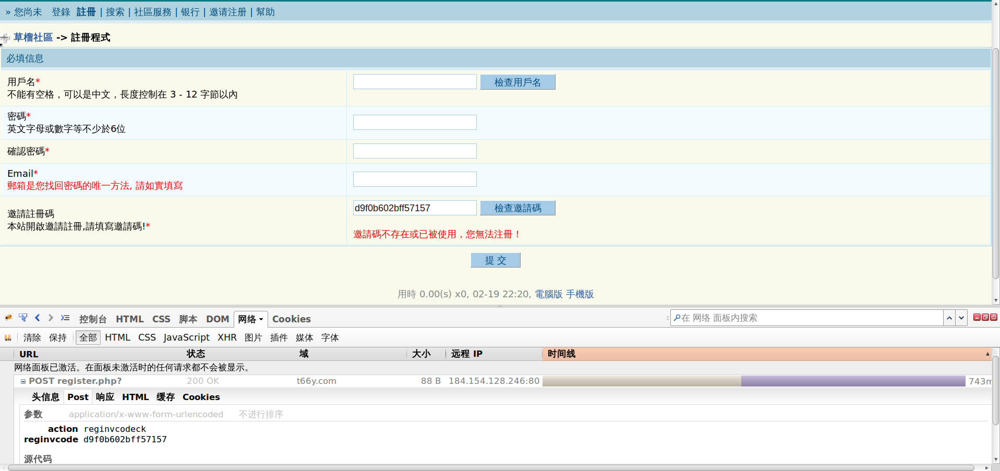
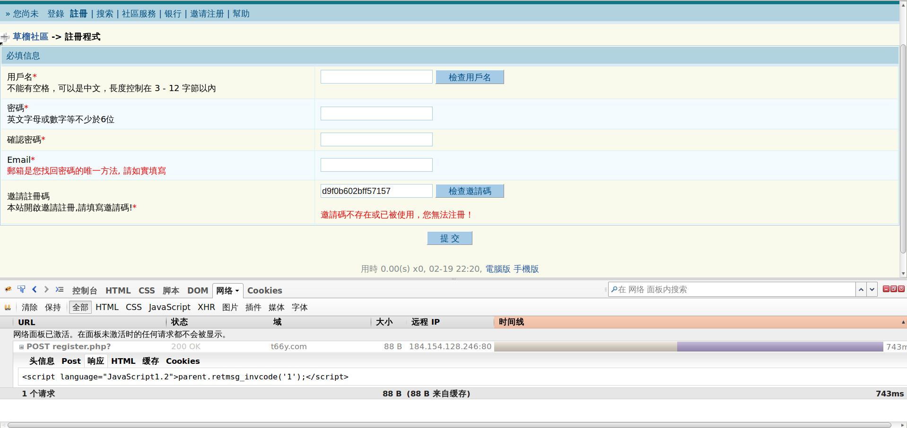
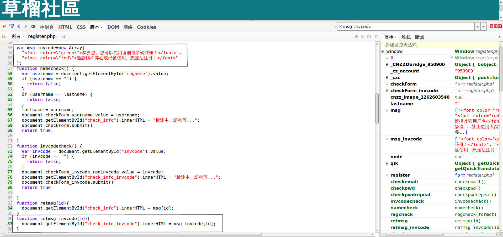

# 1024

迭代尝试得出形如(8da*3705af89bbfc8 被隐藏了一位，用以 * 代替)的 1024 的正确的邀请码

## How to use

在当前目录下新建一个 `code.txt`， 将邀请码复制进去（可以多个），以空格或换行符分隔邀请码，然后运行此脚本即可。
（默认情况下可以对付抹掉一位和两位的邀请码，以字母+数字的情况迭代。若已知抹掉位的类型，请自行修改
脚本最后的 lets_rock(codes, [2]） 函数中的数字，0 为只有数字，1 为只有字母， 2 为默认的字母+数字)

## Details

通过 Firefox 的 Firebug，我们可以在网络的标签下看到当我们点击检查邀请码按钮的时候，
浏览器向 http://t66y.com/register.php? 发出了一条 POST 信息: POST 的参数有
{'action': 'reginvcodeck', 'reginvcode': '邀请码'}

而返回的信息是 ``

我们切换到脚本的标签，并在 `register.php` 中找到了相关的代码

    function retmsg_invcode(id){
        document.getElementById("check_info_invcode").innerHTML = msg_invcode[id];
    }

    var msg_invcode=new Array(
        "恭喜您，您可以使用這個邀請碼註冊！",
        "邀請碼不存在或已被使用，您無法注冊！"
    );

简而言之，POST 返回的信息中的数字如果是 0，则说明邀请码还可以使用； 如果是 1 则不能。
